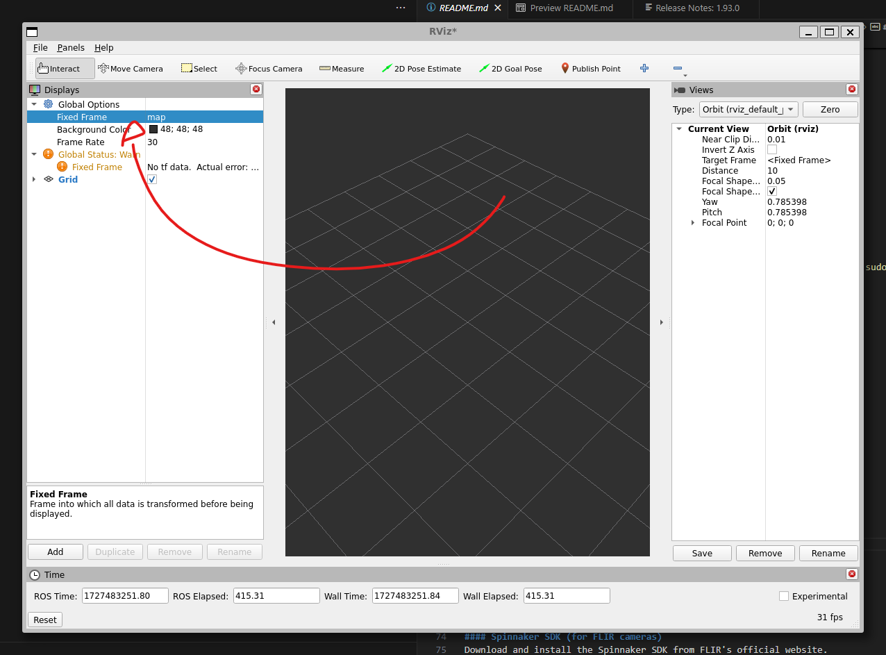

# stereo_image_publisher

This package provides a stereo image publisher for Spinnaker-based Bumblebee X stereo cameras, which captures stereo images, and computes disparity maps on board. The package allows users to publish the captured images and disparity in ROS2. Additionally, the package also demonstrates filtering the disparity image, and generating point cloud.

## Table of Contents
- [System Requirements](#system-requirements)
- [Installation Steps](#installation-steps)
  - [1. Install ROS 2 Humble](#1-install-ros-2-humble)
  - [2. Install Dependencies](#2-install-dependencies)
  - [3. Clone the Repository](#3-clone-the-repository)
  - [4. Build the Package](#4-build-the-package)
- [Running the Application](#running-the-application)
  - [1. Run the Node](#1-run-the-node)
  - [2. Visualize in Rviz](#2-visualize-in-rviz)
  - [3. Control Parameters with RQT](#3-control-parameters-with-rqt)
- [Troubleshooting](#troubleshooting)
- [Additional Resources](#additional-resources)

---

## System Requirements
- **OS**: Ubuntu 22.04 LTS
- **ROS 2 Distribution**: Humble Hawksbill
- **Compiler**: GCC 9 or newer
- **Hardware**: FLIR cameras supported by the Spinnaker SDK

---

## Installation Steps

### 1. Install ROS 2 Humble
Follow these steps to install ROS 2 Humble on Ubuntu 22.04:

```bash
# Set locale
sudo apt update && sudo apt install locales
sudo locale-gen en_US en_US.UTF-8
sudo update-locale LC_ALL=en_US.UTF-8 LANG=en_US.UTF-8
export LANG=en_US.UTF-8

# Setup Sources
sudo apt update && sudo apt install software-properties-common
sudo add-apt-repository universe
sudo apt update && sudo apt install curl
curl -sSL https://raw.githubusercontent.com/ros/rosdistro/master/ros.asc | sudo apt-key add -
# *Warning: apt-key is deprecated. Manage keyring files in trusted.gpg.d instead (see apt-key(8)).
sudo apt-add-repository http://packages.ros.org/ros2/ubuntu

# Install ROS 2 Humble
sudo apt update
sudo apt install ros-humble-desktop

# Source the ROS 2 environment
source /opt/ros/humble/setup.bash

# Install development tools and dependencies for building ROS packages
sudo apt install python3-rosdep python3-colcon-common-extensions
sudo rosdep init
rosdep update
```

### 2. Install Dependencies

#### OpenCV
```bash
sudo apt install libopencv-dev
sudo apt-get install ros-humble-cv-bridge
```

#### PCL (Point Cloud Library)
```bash
sudo apt install libpcl-dev
sudo apt-get install ros-humble-pcl-ros
```

#### Spinnaker SDK (for FLIR cameras)
Download and install the Spinnaker SDK from FLIR's official website.

1. Download the SDK: [Spinnaker SDK Download](https://www.flir.com/products/spinnaker-sdk/)
2. Follow the installation instructions provided with the SDK.

### 3. Clone the Repository

```bash
# Create a workspace for your ROS packages
mkdir -p ~/ros2_ws/src
cd ~/ros2_ws/src

# Clone the stereo_image_publisher repository
# For now, ignore the github and load it from the zip file
git clone https://github.com/TBD/stereo_image_publisher.git
```

### 4. Build the Package

```bash
cd ~/ros2_ws/
colcon build --packages-select stereo_image_publisher
source install/setup.bash
```

---

## Running the Application

### 1. Run the Node

```bash
# Source the workspace
source ~/ros2_ws/install/setup.bash

# Run the stereo image publisher node
ros2 run stereo_image_publisher stereo_image_publisher
```

### 2. Visualize in Rviz

1. Open Rviz:

   ```bash
   rviz2
   ```
   

2. Add the topics for image and point cloud:
   - `/Bumblebee_X/raw_left_image`
   - `/Bumblebee_X/disparity_image`
   - `/Bumblebee_X/point_cloud`

3. Pointcloud Fixed Frame.
   change this to base_link

   


4. Static Transform Pointcloud (Optional)
   - if camera is upright and facing a target we treat the base as the floor for viewing purposes...

      ```bash
      # -1.5708 rad = -90 degrees
      # 1.5 meters
      ros2 run tf2_ros static_transform_publisher 0 0 1.5 0 0 -1.5708 base_link camera_link  
      ```
### 3. Control Parameters with RQT

1. Run RQT to dynamically control the stereo image publisher parameters:
   
   ```bash
   rqt
   ```

2. In RQT, go to the **Plugins** menu and select `Parameters`. You will see the adjustable parameters for the node.

---

## Troubleshooting

1. **Spinnaker SDK Initialization Issues:**
   - Ensure the SDK is sourced correctly:
     ```bash
     source /opt/spinnaker/bin/spinnaker-vars.sh
     ```

2. **ROS2 Not Found:**
   - Ensure ROS2 is sourced:
     ```bash
     source /opt/ros/humble/setup.bash
     ```

3. **Missing Dependencies:**
   - Ensure all required ROS2 and Spinnaker libraries are installed.

4. **Stream Issues:**
   - Ensure the camera is properly initialized and all required streams are enabled via dynamic reconfiguration.

---

## Additional Resources

- [ROS2 Documentation](https://docs.ros.org/en/humble/index.html)
- [Spinnaker SDK Documentation](https://www.flir.com/support-center/iis/machine-vision/downloads/spinnaker-sdk-and-firmware-download/)
- [OpenCV Documentation](https://docs.opencv.org/master/)

---
